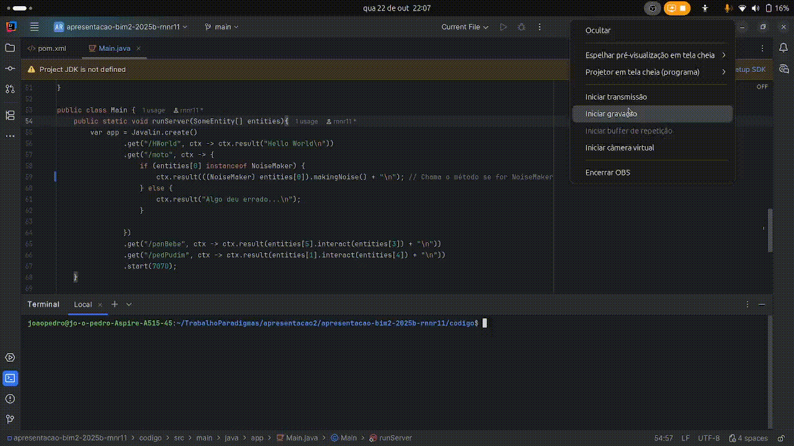

# Segunda Apresentação — Exemplos de Herança e Polimorfismo
O objetivo principal desse trabalho era arranjar um software open source e buscar exemplos de herança e polimorfismo ao longo do seu código-fonte. O tal escolhido foi um framework web chamado Javalin, baseado não só em Java, como também em Kotlin.

## Era pior do que eu pensava...
Apesar de Javalin ser um framework relativamente simples, ele me fez descobrir da pior forma possível que meu "reading" de códigos estava numa situação complicada. Passei um dia inteiro para realizar a atividade, e mais de 70% desse tempo se resumiu a uma bela quebração de cabeça tentando entender o código. De longe, essa foi a parte mais difícil para os meus olhos inexperientes. 

```
import io.javalin.Javalin;

public class HelloWorld {
    public static void main(String[] args) {
        var app = Javalin.create(/*config*/)
            .get("/", ctx -> ctx.result("Hello World"))
            .start(7070);
    }
}
```
O exemplo acima é disponibilizado no próprio repositório do Javalin, sendo o básico do básico. Como meu objetivo era caçar os tais exemplos, eu tinha que começar de algum lugar, e abordagem usada foi começar daqui. 
```
var app = Javalin.create(/*config*/)
```
Busquei a classe Javalin no meio dos arquivos, então logo a encontrei. O método create() acima tem duas definições na classe Javalin, o chamado overload.
```
    public static Javalin create(Consumer<JavalinConfig> config) {
        JavalinConfig cfg = new JavalinConfig();
        JavalinConfig.applyUserConfig(cfg, config); // mutates app.config and app (adds http-handlers)
        Javalin app = new Javalin(cfg);
        app.jettyServer.getValue(); // initialize server if no plugin already did
        return app;
    }
```
```
public static Javalin create() {
        return create(config -> {
        });
}
```
A primeira definição recebe uma função que retorne um objeto JavalinConfig com a configuração do Javalin, então o método retornará o objeto Javalin devidamente customizado. 
No entanto, a segunda definição — que na verdade é a primeira se você for ler o código fonte — é uma versão sem argumentos. Ela chama novamente o método create(), mas com uma função lambda que não faz configuração alguma. Com isso, chamar create() sem argumentos é o mesmo que optar pela configuração padrão do framework.
Mesma função, mesmo nome, mas argumentos e resultados diferentes.

Sobre a herança, temos o tratamento de exceções personalizado. Esse exemplo se trata de uma subclasse de exceções customizadas. Ela extende RuntimeException para uma classe com um método que personaliza a mensagem de exceção.
```
public class TestValidation_Java {
    private static class CustomException extends RuntimeException {
        public CustomException(String message) {
            super(message);
        }
    }
}
```

## E o meu?
Meu código é uma implementação básica de rotas utilizando Javalin. Ele cria um array da superclasse com vários objetos de suas subclasses como elementos. O objetivo é brincar com objetos e seres vivos barulhentos e suas interações.


# Fontes
ANDREA, INF. ELC117 - Aula 23. Disponível em: https://liascript.github.io/course/?https://raw.githubusercontent.com/AndreaInfUFSM/elc117-2025b/main/classes/23/README.md#1

JAVALIN. Javalin - The lightweight web framework for Java and Kotlin. Disponível em: https://javalin.io/

JAVALIN. Javalin - GitHub repository. Disponível em: https://github.com/javalin/javalin
